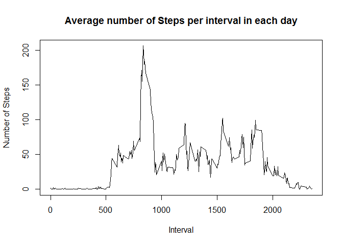
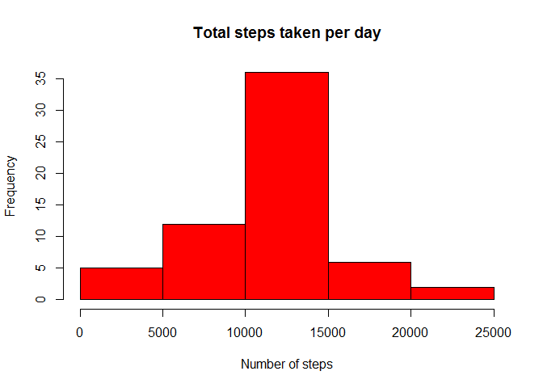
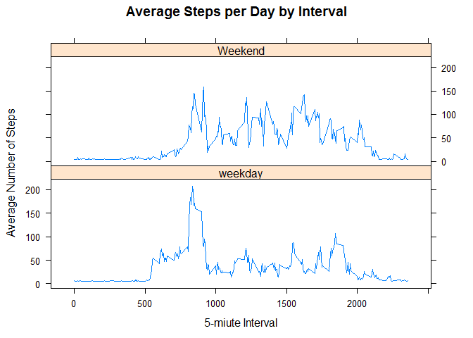

# Reproducible Research: Peer Assessment 1


```r
library(Hmisc)
library(lattice)
```
## Loading and preprocessing 

####1. Loading data

```r
if(!file.exists("activity.csv")){
  unzip("activity.zip")
}
activity_data<-read.csv("activity.csv")
```

## What is mean total number of steps taken per day? 
#####1. Total number of steps per day ignoring missing values 

```r
stepsPerDay <- aggregate(steps~date, activity_data, sum)
```

#####2. Make a histogram of the total number of steps taken each day

```r
hist(stepsPerDay$steps, main=paste("Total steps taken per day"), xlab="Number of steps", col = "red")
```

<!-- -->

#####3. Calculate and report the mean and median of the total number of steps taken per day

```r
mean_stepsPerDay<-mean(stepsPerDay$steps)
median_stepsPerDay<-median(stepsPerDay$steps)
```
* The mean of the dataset is **10766.19** and the median is **10765**. 

## What is the average daily activity pattern?
#####1. Calculate average steps per interval 

```r
average_stepsPerInterval <- aggregate(steps ~ interval, activity_data, mean)
```

#####2. Plot average number of steps per interval in each day 

```r
plot(average_stepsPerInterval$interval,average_stepsPerInterval$steps, type="l", xlab="Interval", ylab="Number of Steps",main="Average number of Steps per interval in each day")
```

<!-- -->

#####3. Which interval contains the maximum number of steps? 

```r
maximum_interval <- average_stepsPerInterval[which.max(average_stepsPerInterval$steps),1]
```
* The interval containing the maximum number of steps is **835**.

## Imputing missing values
#####1. Calculate and report total number of missing values in the dataset

```r
total_NAs <- sum(is.na(activity_data$steps))
```
* The total number of missing values in the dataset is **2304**.

#####2. create a new dataset that is equal to the original dataset but with the missing data filled in

```r
imputedActivityData<-activity_data
imputedActivityData$steps<-impute(activity_data$steps, fun = mean) # Missing data replaced by mean
```

#####3. Make a histogram of the total number of steps taken each day

```r
stepsPerDayImputed <- aggregate(steps~date, imputedActivityData, sum)
hist(stepsPerDayImputed$steps, main=paste("Total steps taken per day"), xlab="Number of steps", col = "red")
```

<!-- -->

#####4. Calculate and report the mean and median total number of steps taken per day

```r
mean_stepsPerDayImputed<-mean(stepsPerDayImputed$steps)
median_stepsPerDayImputed<-median(stepsPerDayImputed$steps)

#Calculate the difference of mean and median of the imputed and non-imputed datasets
meanDifference<-mean_stepsPerDayImputed - mean_stepsPerDay
medianDifference<-median_stepsPerDayImputed - median_stepsPerDay

#Impact of imputing missing data on total daily number of steps
stepsDifference<-sum(stepsPerDayImputed$steps) - sum(stepsPerDay$steps)
```
* The mean of the imputed dataset is **10766.19** and the median is **10766.19**.
* The difference between the imputed data mean and non-imputed data mean is **0**.Thus, the mean remains unchanged. 
* The difference between the imputed data median and non-imputed data median is **1.19**.
* The difference between the total number of steps in the imputed and non-imputed data is 86129.51.Therefore, the imputed data has **86129.51** more steps. 

## Are there differences in activity patterns between weekdays and weekends?
#####1. Create a new factor variable in the dataset with two levels:"weekday" and "weekend"

```r
imputedActivityData$dayType<-ifelse(as.POSIXlt(imputedActivityData$date)$wday %in% c(0,6), "Weekend", "weekday")
```
#####2. Make a panel plot of the 5-minute interval and average number of steps taken

```r
average_imputedActivityData<-aggregate(steps~interval+dayType, imputedActivityData, mean)
xyplot(average_imputedActivityData$steps~average_imputedActivityData$interval|average_imputedActivityData$dayType, main="Average Steps per Day by Interval",xlab="5-miute Interval", ylab="Average Number of Steps",layout=c(1,2), type="l")
```

<!-- -->


